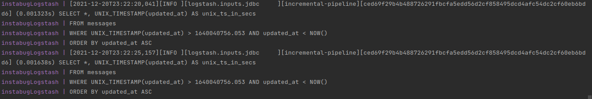

# Introduction
This project is a REST API developed in Golang. It allows users to create, update, and retrieve
1. Applications
2. Chats
3. Messages

Each application has a unique token (that's generated by the system) and a name (given by the user).

Each chat is associated with a specific application, and each message is associated with a specific chat.

Both chats and messages have a number to be identified with, as all IDs are hidden from users.

The application uses MySQL, RabbitMQ, Redis, and Elasticsearch.

##Run The App
1. Clone the repo
2. Navigate to the cloned folder
3. Run `docker-compose up`
4. Wait until you see SQL queries popping to screen

### MySQL

This app uses MySQL to preserve and store the data entered by the user

### Redis

Redis is used to save the maximum chat/message number per application to be fetched quickly later on instead of hitting the DB each time a creation is required

It also holds the total number of chats and messages per application and increment it when a new record is inserted to DB
### RabbitMQ
When users requests to create/update an entity, after being validated, its number is being fetched from Redis before sending it to the queue returning it to the user (while it has not been yet saved to DB).

RabbitMQ Workers are listening to changes in the queue, and persisting the entity to DB.

### ElasticSearch
All messages are being stored and synced into elasticsearch server (using Logstash) to be able to perform full string operations on it faster.

It supports two modes when multiple words are entered (and/or), so if the user is specifying string "Hello World" to search for, he has the option to search for it as a whole query (and) OR he could indicate to search for each word alone (OR).

This is specified by the "operator" field in the search messages endpoints

### Kibana
Kibana is also listed in the docker-compose file, in case you want visual representation for the data

### Full Scenario
I'll demonstrate the full scenario using CreateMessage endpoint, as it contains the Elasticsearch integration and all of its steps are being nearly the same in creating apps & chats

1. User send request to create a message with the specified body, application token, and chat number
2. Golang webserver accepts the request and start processing it
3. Webserver makes sure that the specified application token and chat number are valid (existing combination) by querying DB server
4. Webserver gets the maximum message number from Redis based on the app token & chat number
5. Webserver adds message to the messages queue and return it to the user with the fetched number
6. Workers receive the message and create a new record to the DB
7. Workers increase total-messages stored in Redis and save it to the DB
8. Logstash is querying DB server every 5 seconds to find out if a change has occurred (record is created or updated) based on the updated_at field
9. Logstash adds the new message to the elasticsearch server
